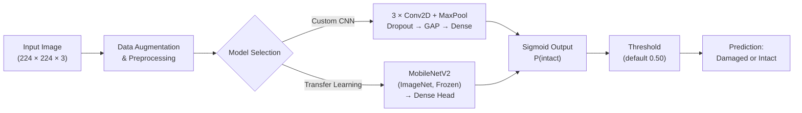
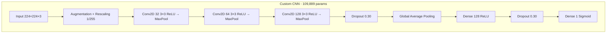
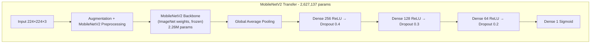
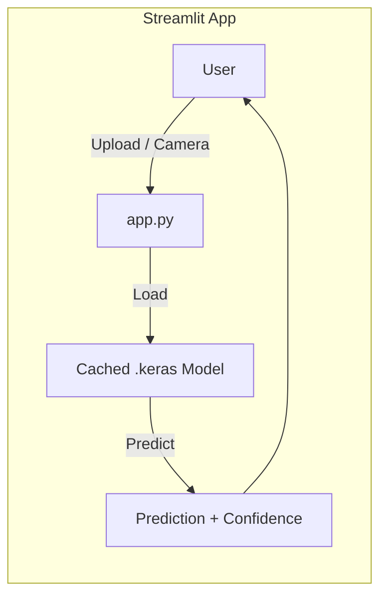

# Package Damage Detection — Deep Learning

Binary image classifier that distinguishes **damaged** from **intact** shipping packages using convolutional neural networks, deployed as an interactive Streamlit web application.

> **Live Demo:** _Link will be added after Streamlit Cloud deployment._

---

## Table of Contents

1. [Objective](#objective)
2. [Business Value](#business-value)
3. [Dataset](#dataset)
4. [Architecture](#architecture)
5. [Model Performance](#model-performance)
6. [Project Structure](#project-structure)
7. [Getting Started](#getting-started)
8. [Usage](#usage)
9. [License](#license)

---

## Objective

Automate the visual inspection of shipping packages at warehouse intake, last-mile delivery, or returns processing. The system accepts a single photograph (upload or live camera) and returns a **damaged / intact** prediction with a confidence score, enabling faster triage and reducing manual inspection effort.

---

## Business Value

| Benefit | Impact |
|---|---|
| **Reduced labor costs** | Replaces or augments manual visual inspection at scale |
| **Faster throughput** | Sub-second inference enables real-time sorting on conveyor lines |
| **Consistent quality** | Eliminates subjective human judgment and inspector fatigue |
| **Claims & liability** | Photographic evidence paired with a model verdict strengthens damage claims |
| **Scalability** | Deploys on edge devices (MobileNetV2) or cloud with no retraining |

---

## Dataset

| Class | Images |
|---|---|
| Damaged | 286 |
| Intact | 342 |
| **Total** | **628** |

Images are sourced from the [Damaged and Intact Packages](https://www.kaggle.com/datasets/rahulm7323/damaged-and-intact-packages/data) dataset on Kaggle — photographs of food-item packaging boxes in JPEG and WebP formats. The dataset is split **70 / 15 / 15** (train / validation / test) with a fixed random seed for reproducibility.

To use the dataset locally, download it from Kaggle and place the contents in the `dataset/` directory:

```bash
kaggle datasets download -d rahulm7323/damaged-and-intact-packages
unzip damaged-and-intact-packages.zip -d dataset/
```

**Data augmentation** applied during training: random horizontal flip, rotation (±8°), zoom (15%), translation (8%), contrast (20%), and brightness (12%).

---

## Architecture

Two models are trained and compared. The Streamlit app lets users switch between them at inference time.

### High-Level Pipeline



### Custom CNN



### MobileNetV2 Transfer Learning



### Streamlit Application



---

## Model Performance

Results on the held-out **test set** (96 images):

| Metric | Custom CNN | MobileNetV2 (Frozen) |
|---|---|---|
| **Accuracy** | 85.4% | 91.0% |
| **AUC** | 0.901 | 0.949 |
| **Precision (damaged)** | 0.79 | 0.95 |
| **Recall (damaged)** | 0.95 | 0.86 |
| **F1 (macro avg)** | 0.85 | 0.91 |

MobileNetV2 with a frozen backbone was selected as the production model due to its stronger overall performance and stability.

---

## Project Structure

```
package-damage-detection-deep-learning/
├── src/
│   ├── app.py                          # Streamlit web application
│   └── models/
│       ├── custom_cnn_best.keras       # Trained Custom CNN weights
│       └── mobilenetv2_stage1_best.keras  # Trained MobileNetV2 weights
├── notebooks/
│   └── model-training.ipynb            # Training & evaluation notebook (Google Colab)
├── dataset/                            # Dataset (not tracked in git)
│   ├── damaged/                        # 286 images
│   └── intact/                         # 342 images
├── .gitignore
└── README.md
```

---

## Getting Started

### Prerequisites

- Python 3.9+
- pip

### 1. Clone the Repository

```bash
git clone https://github.com/<your-username>/package-damage-detection-deep-learning.git
cd package-damage-detection-deep-learning
```

### 2. Install Dependencies

```bash
pip install tensorflow streamlit numpy pillow
```

### 3. Obtain Model Weights

The trained `.keras` model files are stored under `src/models/`. If they are not included in the repository (due to size), retrain using the provided notebook (`notebooks/model-training.ipynb`) on Google Colab, then copy the output weights into `src/models/`.

### 4. Launch the Application

```bash
cd src
streamlit run app.py
```

The app will open in your browser at `http://localhost:8501`.

---

## Usage

1. **Select a model** from the sidebar (Custom CNN or MobileNetV2).
2. **Adjust the decision threshold** if needed (default 0.50).
3. **Upload an image** or **take a photo** using your device camera.
4. View the **prediction label**, **confidence score**, and **probability bar**.

---

## License

This project was developed for academic purposes. Please contact the authors before using it in production environments.
